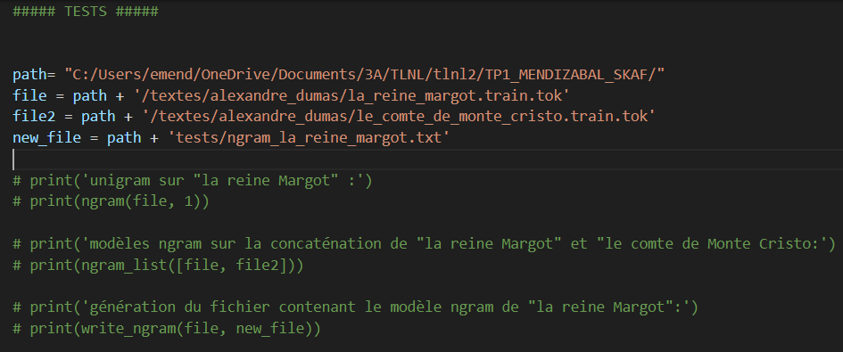

# README TP1 TLNL 

Ce README présente les codes fournis dans le cadre du TP1. Ce dernier nous permet d'étudier le modèle ngram avec hypothèse de Markov. 
Les codes sont lancés avec Python 3.11.6

## Contenu du dossier "TP1_codes" : 

- [TP1_codes](#READMETP1TLNL)
  - [ngram.py](#ngram)
  - [perplexite.py](#autres-scripts)
  - [genere.py](#autres-scripts)
  - [devine.py](#autres-scripts)
  - [paternite.py](#autres-scripts)
  - [courbe_apprentissage.py](#autres-scripts)
  - [masque_noms_propres.py](#autres-scripts)

## Autres dossiers : 

- tests

Ce dossier peut servir à recueillir des fichiers générés au cours de ce TP lors de tests (fichiers ngrams, textes nettoyés des noms propres, fichiers contenant une phrase pour tester la parentalité à l'échelle d'un texte, etc ...). Nous avons laissé des fichiers en exemple. 

- textes

Ce dossier contient les corpus utilisés pour les approfondissements notamment. Vous pouvez accéder au dossier zip via ce lien :

  <a href="https://drive.google.com/drive/folders/10H31eiSedn_2qCEOz_o8Gm-Qzh2tckjG?usp=sharingk" style="display: inline-block;">Lien dossier "textes" google Drive</a>

Le dossier est composé de plusieurs corpus : 
  - alexandre_dumas
  - honore_de_balzac
  - jul
  - jules_verne
  - marie_lebert
  - wikipedia

Pour lancer plus facilement les examples, vous pouvez télécharger ce dossier, le déziper et le placer à l'intérieur du dossier TP1_Mendizabal_Skaf. 

Découvrons maintenant les différents codes créés : 

## ngram

Le script ngram.py, comme tous les autres scripts de ce dossier, est séparé en 2 parties : le code et les tests. 

Le code contient 3 fonctions, commentées dans le script: 

  - ngram
  - ngram_list
  - write_ngram

La partie tests ressemble à ceci : 

Pour lancer ce test, veuillez modifier le path (première variable) et désindenter les lignes de print qui vous intéressent. Pour générer le fichier contenant les uni, bi et trigram du fichier "la_Reine_Margot.train.tok" par exemple, vous pouvez lancer les 2 dernières lignes de print. Ce nouveau fichier sera créé au path de la variable "new_file". 

Il vous suffit ensuite d'ouvrir votre terminal, de vous mettre à l'emplacement de TP1_codes et de lancer le code, comme présenté ci-dessous. 

    >> cd your_path_to_TP1_codes
    >> python3 ngram.py

## Autres scripts

Tous les autres scripts sont écrits de la même manière (partie code puis partie test, avec un path à adapter et des propositions de print).

Attention pour le script courbe_apprentissage.py, si vous souhaitez tracer les courbes vous devez installer plotly au préalable : 

    >> pip install plotly
